# SOS2me

**Your child's messages, as a phone call.**

<p align="center">
  <a href="docs/media/sos2me-promo.mp4">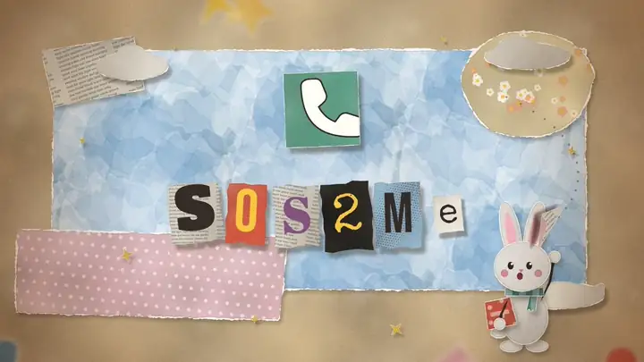</a><br>
  <b><a href="docs/media/sos2me-promo.mp4">▶ Watch the 60-second story, with sound</a></b><br>
  <sub>A paper-collage short: why SOS2me exists, a typical emergency, and how one tap becomes a phone call that keeps ringing until someone presses 1.
  Also: <a href="https://www.youtube.com/watch?v=6ILbX7fhgSg">the earlier 45-second intro on YouTube</a>.</sub>
</p>

Kids often have a phone that can send messages but can't always call, or can't talk. SOS2me
turns their message into a **phone call to a parent that reads the message aloud**. For
anything urgent, it keeps calling Mum, then Dad, then Mum again, until someone **presses 1**.

It also helps you understand what's going on: each message carries **clues about where your child is**,
the kid page and email replies **ask them for more details**, and the AI reads their **recent messages and
usual routine** to tell you what is most likely happening right now.

It runs on Cloudflare's free tier. The only paid part is Twilio, which charges a few cents per call.

```
 Child                               SOS2me (Cloudflare Worker)                         Parents
 ─────                               ──────────────────────────                         ───────
 Kid page (PIN, SOS, quick replies) ─┐
   + location, network, device clues │
 Mailboxes (AgentMail / Gmail IMAP) ─┼─► urgent words ─► AI (emotion & risk) ─► urgent ─► call until "press 1" + SMS + email
 ntfy topics · Email Routing        ─┘                                        ├► check in ─► call + SMS + email
                                                                              └► everyday ─► one call reading the message
 recent messages + usual routine + clues ─► AI "what's happening" ─► read out on the call, emailed to parents
 "Help them find you" tips · replies to urgent emails ─► the child adds what they see and hear
 daily system check ─► email / SMS parents if anything is broken
```

## Gallery

<table>
  <tr>
    <td width="33%" align="center">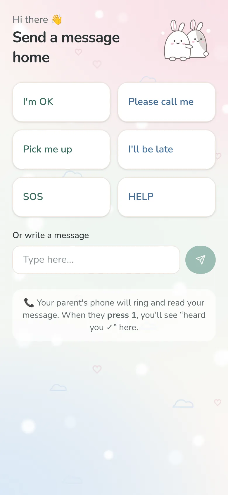<br><sub><b>Kid page</b>: one tap to message home</sub></td>
    <td width="33%" align="center">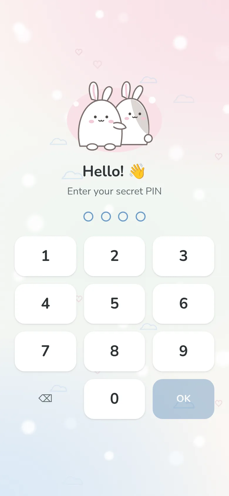<br><sub><b>PIN</b>: asked once per phone</sub></td>
    <td width="33%" align="center">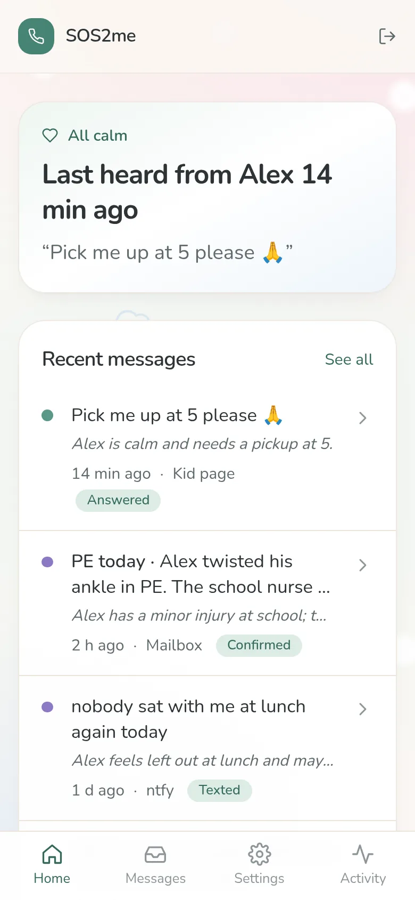<br><sub><b>Dashboard on a phone</b></sub></td>
  </tr>
</table>

<p align="center">
  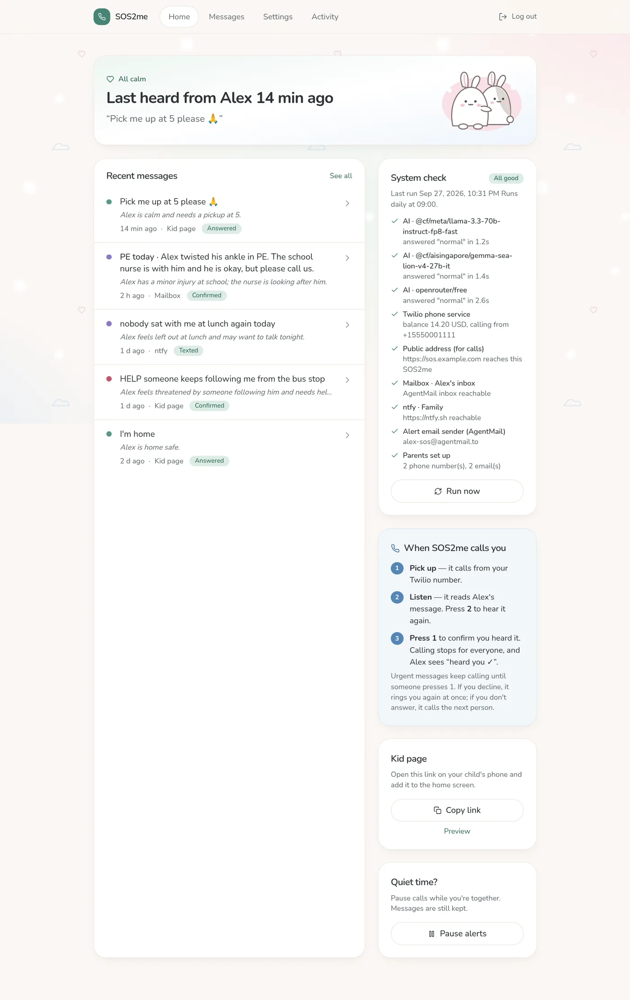<br>
  <sub><b>Parent dashboard</b>: last message, AI notes, the daily system check, and what to do when SOS2me calls</sub>
</p>

<table>
  <tr>
    <td width="50%">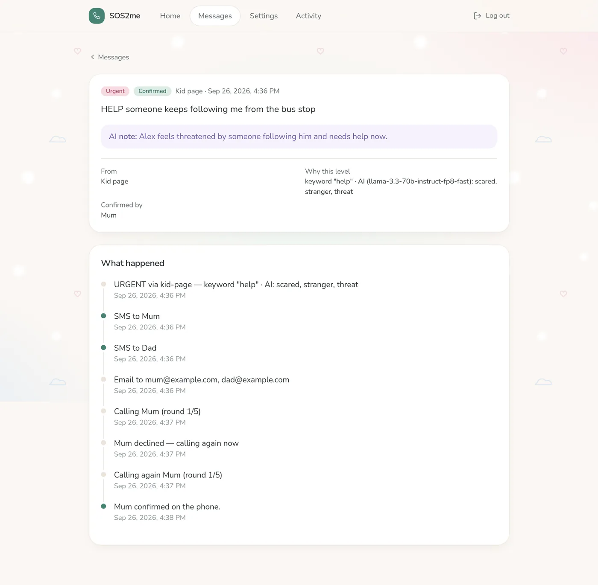<br><sub><b>What happened</b>: an urgent message, a declined call redialled, then Mum pressed 1</sub></td>
    <td width="50%">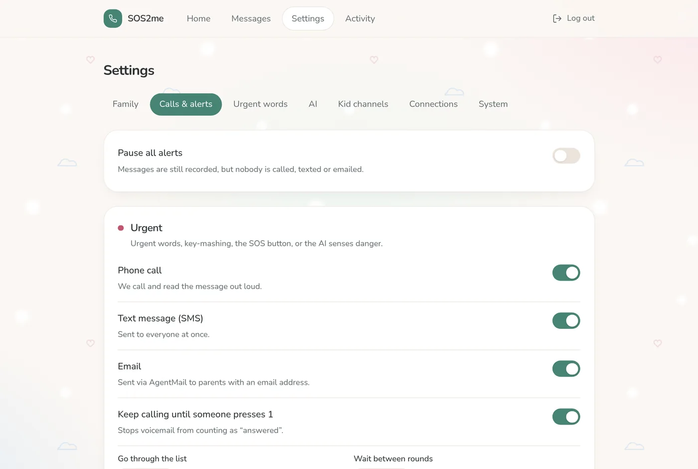<br><sub><b>Calls & alerts</b>: rounds, retries and redial for each level</sub></td>
  </tr>
  <tr>
    <td width="50%">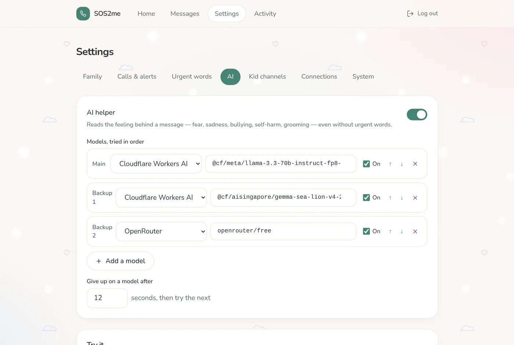<br><sub><b>AI</b>: Cloudflare models first, free fallbacks after</sub></td>
    <td width="50%">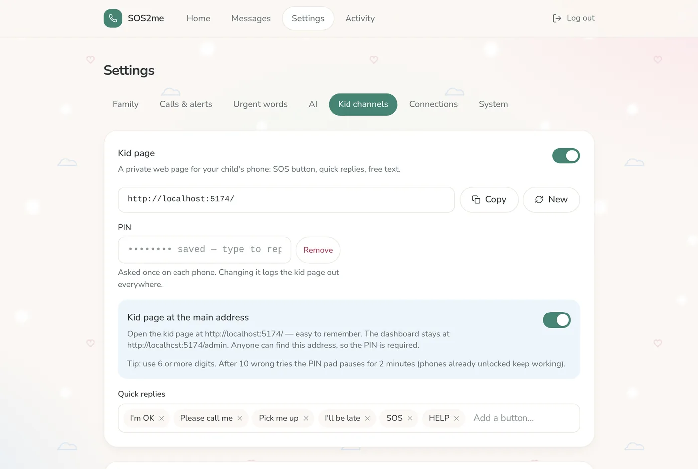<br><sub><b>Kid channels</b>: kid page, mailboxes, ntfy, watched names</sub></td>
  </tr>
  <tr>
    <td width="50%">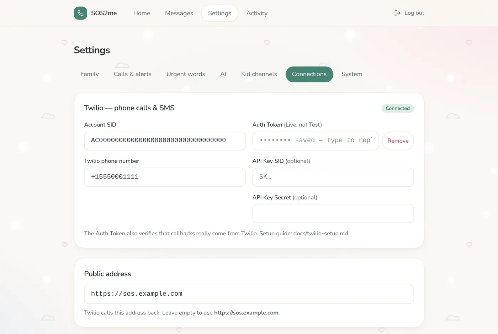<br><sub><b>Connections</b>: keys are write-only</sub></td>
    <td width="50%">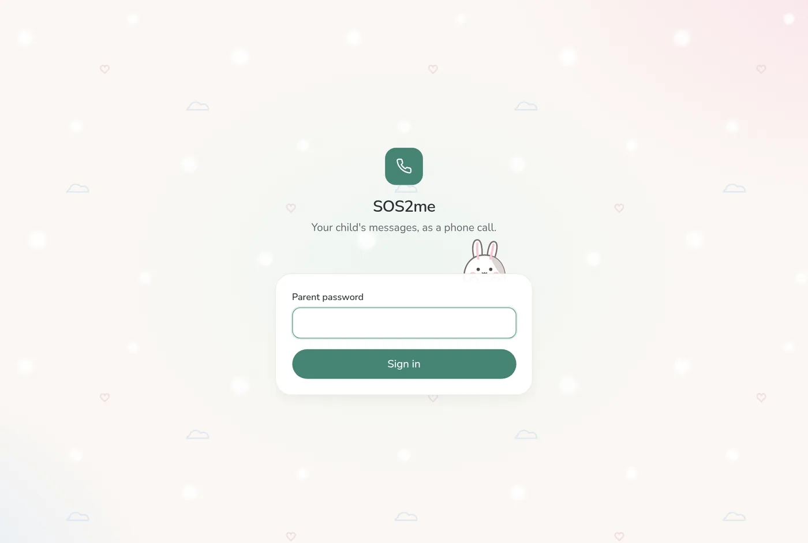<br><sub><b>Parent login</b></sub></td>
  </tr>
</table>

<sub>Screenshots use a demo family (Alex, Mum and Dad) with made-up numbers.</sub>

## Features

**Ways your child can reach you**

- **Kid page:** at your main address (e.g. `https://sos.example.com/`), or a secret `/k/<token>` link.
  - Needs a PIN, and has a calm pastel design with little bunnies.
  - One-tap replies (e.g. "SOS", "Pick me up") and free text. The dashboard lives at `/admin`.
  - Shows "Mum heard you ✓" once a parent confirms.
  - Can be triggered from an iPhone Shortcut, Siri or Back Tap ([docs/ios.md](docs/ios.md)).
- **Mailboxes, checked every minute:** as many as you like. AgentMail inboxes, plus Gmail, Outlook
  or iCloud over IMAP with an app password. Mail from senders not on the allowed list is ignored.
- **Emails that mention your child:** mail from anyone else, such as a teacher or another parent, is read by the
  AI when it clearly names someone on your watch list (e.g. "Alex"). You're only called or texted if it's
  urgent or worth a check-in; everyday mail like newsletters is just recorded.
- **ntfy topics:** as many servers or topics as you like, each with an optional access token or username + password.
- **Cloudflare Email Routing:** mail to `sos@your-domain` arrives instantly.

**Deciding how urgent a message is**

- **About 165 urgent phrases** built in, in English, Chinese and Malay. Chosen to avoid false
  alarms: "I'm lost" is on the list, but "lost" on its own is not.
- **An AI helper** reads the emotion and situation: fear, sadness, bullying, self-harm (including
  indirect wording), online grooming, and injury.
  - It returns one of three levels: **urgent**, **check in** or **everyday**.
  - It adds a one-line note for you, e.g. "Alex feels threatened by a follower".
  - Models are tried in order: Cloudflare Llama 3.3 70B, then SEA-LION (Singlish and Chinese), then free OpenRouter models.
  - In testing, the prompt classified all 16 test messages correctly on both Cloudflare models ([docs/review.md](docs/review.md)).
- **Voicemail can't stop an alarm:** urgent calls only stop when someone presses 1.
- **Declined call:** SOS2me rings the same person again immediately (on iPhone, a second call within
  3 minutes rings through Do Not Disturb). **No answer:** it moves to the next emergency contact.

**Understanding what's happening**

- **One tap sends clues:** every kid page message carries where the child is:
  - GPS (if they allow it), with the street and nearby landmarks from OpenStreetMap
  - IP address, its hostname and internet provider, and the approximate city
  - Wi-Fi or mobile data, battery, device and browser, time zone

  Web pages can't read the Wi-Fi network name or the phone's name.

- **"Help them find you":** after sending, the kid page shows tips so the child can add what they see
  (a building, park or sign), what they hear, what the room looks like, or who is with them. Details join
  the same alert without extra calls; a detail with urgent words starts a new alert.
- **Reply to urgent emails:** when the child's email is urgent or a check-in, SOS2me replies straight
  away with the subject "Delete me after reading". It starts with a safety reminder (call 999 / 995),
  then asks the same questions.
- **What's happening (AI prediction):** after each message the AI looks at everything received: the
  recent messages (default: last 6 hours, up to 8), local time, where the phone is, nearby places,
  battery, network, the child's added details, and their **usual routine** from the last 30 days. It
  writes two short lines: what is most likely happening now, and what comes next, e.g. "Alex is at the
  library, not home at the usual time, and thinks someone is following him." It points out what's
  unusual and doesn't alarm you about what's normal for your child.
  - The call reads it out together with the child's location.
  - Alert emails include it, with a map link, and it's emailed to you after every message (can be turned off).

**Settings and monitoring**

- **Everything is configurable on the settings page:**
  - family, call order and rounds per level
  - urgent words and the AI model chain
  - the "what's happening" prediction: on/off, how far back to look, emailing it after every message
  - voice, and what the call reads out (the message, the AI note, the prediction and location)
  - every channel
  - Twilio, AgentMail and AI keys (write-only, shown as dots)
  - dashboard password and kid PIN
- **Daily system check:** tests every AI model, Twilio, each mailbox and ntfy topic, and email
  sending. It emails you (and optionally texts you) if anything is broken.

## What you need (dependencies)

| Service                                           | Needed for                                                       | Cost                                                                               | Notes                                   |
| ------------------------------------------------- | ---------------------------------------------------------------- | ---------------------------------------------------------------------------------- | --------------------------------------- |
| [Cloudflare](https://dash.cloudflare.com/sign-up) | Hosting: Workers, D1 database, Durable Objects, cron, Workers AI | Free plan is enough                                                                | `wrangler login` from this repo         |
| [Twilio](https://www.twilio.com/try-twilio)       | Phone calls + SMS to parents                                     | Trial credit to start; then about $1/month for a number + a few cents per call/SMS | Use an **API key** (see below)          |
| [AgentMail](https://agentmail.to)                 | Receiving the child's email, sending alert/daily-check emails    | Free tier                                                                          | Recommended email channel               |
| [ntfy](https://ntfy.sh)                           | Optional push channel from the child's phone                     | Free (ntfy.sh) or self-hosted                                                      | See below                               |
| [OpenRouter](https://openrouter.ai)               | Optional backup AI model                                         | Free models available                                                              | Cloudflare Workers AI is the main model |
| Node.js 22+ and pnpm                              | Building and deploying                                           | Free                                                                               | `corepack enable`                       |

### Email: AgentMail (recommended)

1. Create a free inbox at [agentmail.to](https://agentmail.to), e.g. `alex-sos@agentmail.to`, and an API key.
2. Get the child's mail into it in one of these ways:
   - **Give the child that address**, and save it as a contact such as "Home".
   - **Forward only the child's mail to it.** In the parent's Gmail, create a filter
     `from:(child@gmail.com)` → _Forward to_ `alex-sos@agentmail.to`. Gmail sends a confirmation email
     to that inbox first; open it in the AgentMail console and click the link.
   - **Or skip AgentMail for receiving** and let SOS2me read a mailbox directly over IMAP
     (Gmail/Outlook/iCloud with an _app password_): Settings → Kid channels → Mailboxes → IMAP.
3. Put the API key and inbox under Settings → Connections (or `services.agentmailApiKey` / `agentmailFrom`).
   Alert and daily-check emails are sent from that inbox.

### Twilio: trial account + API key

1. Sign up at [twilio.com/try-twilio](https://www.twilio.com/try-twilio). Trial accounts get free credit.
2. **Verify every parent's number** under _Phone Numbers → Manage → Verified Caller IDs_. Trial
   accounts can only call and text verified numbers, and play a short trial notice first.
3. _Phone Numbers → Manage → Buy a number_ (free on trial) with **Voice** (+ SMS).
4. _Voice → Settings → Geo permissions_ (and _Messaging → Geo permissions_): tick the parents' country.
5. Console → **Account → API keys & tokens → Create API key**, type **Standard**. Copy the **SID (SK…)**
   and **Secret** (shown once).
6. In SOS2me → Settings → Connections → Twilio, enter:
   - **Account SID:** the Live `AC…` on the Console home page, _not_ the Test credentials
   - **API Key SID** and **API Key Secret**
   - **Twilio phone number**
   - Optional: the Live **Auth Token**, which lets SOS2me verify Twilio's callbacks
7. Press **Test call**. Details and troubleshooting: [docs/twilio-setup.md](docs/twilio-setup.md).

### ntfy: free push channels

1. Install the ntfy app ([Android](https://play.google.com/store/apps/details?id=io.heckel.ntfy) /
   [iOS](https://apps.apple.com/app/ntfy/id1625396347)) on the child's phone.
2. Pick a **long random topic**, e.g. `alex-sos-7f3k2q9x`. Public ntfy.sh topics can be read and posted to
   by anyone who guesses the name, so never use short names like `999`.
3. Add it in Settings → Kid channels → ntfy topics (server `https://ntfy.sh`).
4. The child posts from the app, or runs `curl -d "pick me up" ntfy.sh/alex-sos-7f3k2q9x`.
   For privacy, [self-host ntfy](https://docs.ntfy.sh/install/) with a login and enter the username/password.

### Not supported: WhatsApp, iMessage, SMS inbox

There is no official way for a server to read a child's WhatsApp or iMessage chats. It would need an
unofficial client logged in on a separate PC or phone (or a local agent), which is fragile and against
WhatsApp's terms, so SOS2me doesn't do it. Use the kid page, email or ntfy instead.

## Install with an AI coding agent

Paste this into Claude Code, Codex, or a similar agent:

> Clone https://github.com/jstdlee/sos2me and deploy it to my Cloudflare account by following its README and
> `docs/deploy-cloudflare.md`:
>
> 1. Install with pnpm.
> 2. Run `wrangler login`.
> 3. Create the D1 database.
> 4. Copy `wrangler.jsonc` to `wrangler.local.jsonc` and put the database id there.
> 5. Copy `config.example.json` to `config.json` and fill it in _with me_: ask me for the child's name,
>    parents' phone numbers, Twilio Account SID, API key and number, AgentMail key and inbox, and the kid PIN.
>    Never commit `config.json` or `wrangler.local.jsonc`, and never paste my keys anywhere else.
> 6. Run `pnpm run deploy`, then tell me the URL and run a test call with me.

## Quick start (local)

```bash
pnpm install
cp config.example.json config.json   # fill in — comments explain every field
pnpm dev                              # applies config.json to the local DB, starts http://localhost:5173
```

Open http://localhost:5173/admin and log in with the `adminPassword` from `config.json` (the kid page is at `/`).

**`config.json` and the dashboard stay in sync:**

- **Local:** while `pnpm dev` runs, every change you save in the dashboard is written back into `config.json`
  within a few seconds, keeping your comments.
- **Online:** changes saved in the deployed dashboard live in your Cloudflare D1 database.
  - Run `pnpm config:pull:remote` to copy them into `config.json`.
  - `pnpm run deploy` refuses to overwrite dashboard changes you haven't pulled yet (unless you add `--force`).

Twilio can't call back to `localhost`. To test real calls, deploy, or run a tunnel
(`cloudflared tunnel --url http://localhost:5173`) and put its https address in
Settings → Connections → Public address.

| Command                   | What it does                                                       |
| ------------------------- | ------------------------------------------------------------------ |
| `pnpm dev`                | Migrate + apply `config.json` locally, start Vite+ with the Worker |
| `pnpm test`               | Unit tests (`vp test`)                                             |
| `pnpm check`              | Format + lint (`vp check`)                                         |
| `pnpm typecheck`          | `vue-tsc` + `tsc`                                                  |
| `pnpm config:local`       | Force re-apply `config.json` to the local database                 |
| `pnpm config:remote`      | Apply `config.json` to Cloudflare D1 (if changed)                  |
| `pnpm config:pull`        | Write local dashboard changes back into `config.json`              |
| `pnpm config:pull:remote` | Write online dashboard changes back into `config.json`             |
| `pnpm run deploy`         | Build, migrate D1, apply `config.json`, deploy to Cloudflare       |

## Guides

- [Deploy to Cloudflare](docs/deploy-cloudflare.md)
- [Set up Twilio (phone calls and SMS)](docs/twilio-setup.md)
- [iPhone tips](docs/ios.md): make calls ring through Silent/Focus, and one-tap SOS from a Shortcut
- [Code review and design notes](docs/review.md)

## Secrets and the public repo

- **`wrangler.local.jsonc`** (git-ignored) holds your database id and domain; `wrangler.jsonc` is only a template.
- **`config.json`** holds your real settings and keys. It is **git-ignored**; only
  `config.example.json` is committed. It is **never bundled into the Worker**: deploy copies it into
  D1 with `wrangler d1 execute`, and the build output was checked to contain no keys.
- **After it's applied,** everything lives in your private Cloudflare D1 database:
  - Passwords and PINs are stored hashed.
  - API keys are never sent back to the browser, which only shows `••••••••`.
- **Location and device clues** are stored with each message in your own D1 database. To name the street
  and nearby places, the GPS position is sent to OpenStreetMap (Nominatim and Overpass); the IP's
  hostname is looked up via Cloudflare DNS. Messages and clues are also sent to the AI models in
  your model chain (Workers AI first; SEA-LION and OpenRouter only if you configure them).
- **Environment secrets** (`wrangler secret put TWILIO_AUTH_TOKEN`, …) still work as a fallback if you prefer them.

## Stack

- **Toolchain:** [Vite+](https://viteplus.dev), i.e. `vp dev / build / test / check`
- **App:** Vue 3 and Tailwind CSS v4
- **Server:** a Cloudflare Worker using [Hono](https://hono.dev)
- **Data:** D1 (SQLite)
- **Calling loop:** one Durable Object per alert, driven by alarms
- **Services:** Twilio for calls and SMS; AgentMail for email; Workers AI and OpenRouter for the AI helper

```
src/        Vue app (dashboard + kid page)        worker/   Worker: API, webhooks, pollers, escalation DO
shared/     types + defaults shared by both        scripts/  config.json → D1
migrations/ D1 schema                              docs/     guides (docs/archive = original PRD/TRD)
```

## License

MIT
